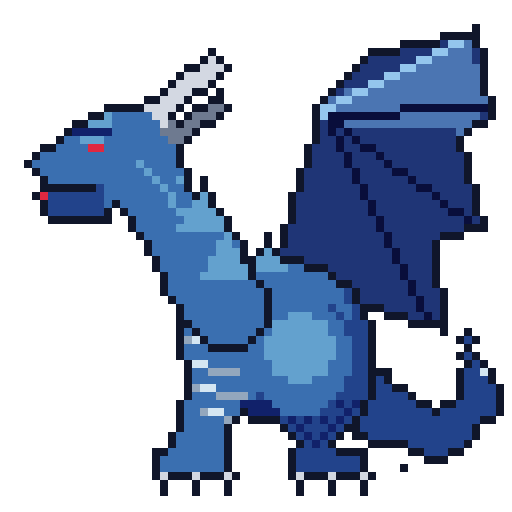
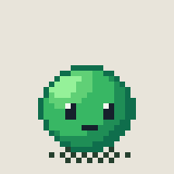
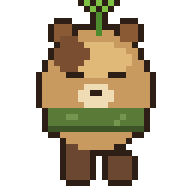
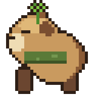
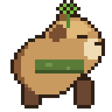
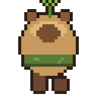

# 🎨 Pixel Art Studio

**An Agent Skill that makes Claude a pixel artist — no Aseprite, no MCP server, no image generator.**
Claude designs and places every pixel directly through Python/Pillow, looks at its own render,
critiques it against a professional checklist, and iterates until it ships.

<p align="center">
  
  
  
</p>

*Everything above was drawn pixel-by-pixel by Claude using this skill — characters, shading,
animation and exports, from a text prompt (and one reference image it studied first).*

## Why

Most "AI pixel art" is diffusion output that ignores the grid. This skill takes the opposite path:
the LLM is the artist and a tiny deterministic library is its hand. Every color is a decision,
every pixel is placed on purpose, and the render is reproducible from a build script.

The quality engine is a **see → critique → fix loop**: Claude renders a contact-sheet preview,
reads the image with its own vision, critiques it against `references/validations.md`, edits
the build script, and re-renders — minimum 2–3 passes before delivering.

### Two ways to use it

1. **Draw from scratch** — Claude authors every pixel via Pillow. No model, fully deterministic,
   infinitely editable. Best for characters, items, tiles, animations you control end-to-end.
2. **Hybrid with any generator** — feed a messy/AI-generated PNG through `pixelpipe` and it
   recovers the true grid, strips baked-in backgrounds, hardens alpha, kills orphan noise,
   collapses the color explosion, and **locks the result onto a shared palette** — then hands you
   a build script to keep editing and animating deterministically. Best for richly-detailed art
   where a model's composition shines but you still need clean, consistent, editable pixels.

## Install

```bash
git clone https://github.com/Gamezxz/pixel-art-studio.git
cp -r pixel-art-studio ~/.claude/skills/pixel-art-studio   # or <project>/.claude/skills/
pip3 install pillow
```

Then just ask Claude Code: *"draw a 64x64 dragon boss"*, *"make a 4-frame slime idle animation"*,
*"turn this sprite into a Game Boy palette"*.

> Note: SKILL.md examples reference the skill path — adjust the `sys.path.insert` path in the
> examples if you install somewhere other than a `.claude/skills/pixel-art-studio` folder.

## What's inside

| Piece | What it does |
|---|---|
| `scripts/pixelstudio.py` | The drawing engine: frames × layers, pixel-perfect primitives, palette locking, hue-shifted `ramp()`, Bayer dithering, selective outlines, mirror/shift, exports PNG / animated GIF / spritesheet + Aseprite-compatible JSON |
| `scripts/study.py` | Analyzes any pixel-art file: recovers true resolution from (even sloppy) upscales, strips baked-in checker backgrounds, extracts palettes/ramps/outline/dither stats |
| `scripts/pixelpipe.py` | **Hybrid pipeline**: turns AI-generated / messy PNGs into clean, palette-locked, editable pixel art — the deterministic cleanup+lock layer on top of any image model |
| `references/*.md` | The knowledge: proportions & silhouette-first workflow, color/shading/dithering/AA techniques, animation timing tables, palette presets (Game Boy, PICO-8, Sweetie16, C64, Endesga32), export/engine guides, failure modes, and the per-iteration critique checklist |
| `references/learned/` | The skill grows: study a reference image → write a style card → its rules and palette become available for future artwork |
| `examples/slime-build.py` | A complete worked example: parametric character, 4-frame idle animation, all export paths |
| `examples/capybara-4dir.py` | 4-direction character (down/left/right/up) with a 4-frame walk cycle per direction — one parametric draw function per view, spritesheet + engine JSON + per-direction GIFs |

### 4-direction walk example

<p align="center">
  
  
  
  
</p>

*A chibi capybara (sprout + scarf, from a reference photo the skill studied) — 32×32/frame,
12 colors, contact-passing walk construction. Regenerate everything with
`python3 examples/capybara-4dir.py`.*

## The workflow

```python
from pixelstudio import Sprite, ramp

BODY = ramp("#38b764", 5)                 # hue-shifted 5-step ramp
s = Sprite(32, 32, palette=BODY + ["#1a1c2c"])

s.ellipse(6, 12, 25, 27, BODY[0])                       # darkest = silhouette
s.ellipse(5, 11, 23, 26, BODY[2], only="opaque")        # restack lighter, shifted to light
s.outline(BODY[0], where="inside")                      # selective outline

s.preview("preview.png", scale=10)        # Claude LOOKS at this
s.stats()                                 # ...and reads these numbers
s.save_gif("out.gif", scale=6)
```

The build script *is* the artwork — deterministic, diffable, re-renderable.
Animation frames are function calls with parameters (squash, bob, pose), not hand-copied pixels.

## Learning from reference art

```bash
python3 scripts/study.py reference.png --save-palette my_style
# handles resampled upscales & baked-in checkerboards:
python3 scripts/study.py sloppy_screenshot.png --scale 6 --strip-checker
```

Claude inspects the analysis, writes an imperative style card into `references/learned/`,
and applies those rules the next time you ask for art in that style. The witch above was
drawn this way — from a style card learned off a single reference image.

## Hybrid pipeline — clean & lock generated art

```bash
# any image model's output → clean, palette-locked, editable pixel art
python3 scripts/pixelpipe.py generated.png --strip-checker --max-colors 24
# lock every asset onto one shared game palette (cross-asset consistency):
python3 scripts/pixelpipe.py generated.png --palette my_game
```

`pixelpipe` recovers the true pixel grid (block-sampling survives sloppy/resampled upscales —
no mixels), strips baked-in checkerboards, hardens alpha, despeckles, dedupes colors, and locks
the palette. It emits a `clean.png` **plus a regenerable `build.py`**, so the "AI-assisted"
sprite is now as editable as one drawn from scratch — and every asset shares one color
vocabulary, so a whole cast looks like one game. See `references/cleanup.md`.

## License

MIT © [Gamezxz](https://github.com/Gamezxz)
